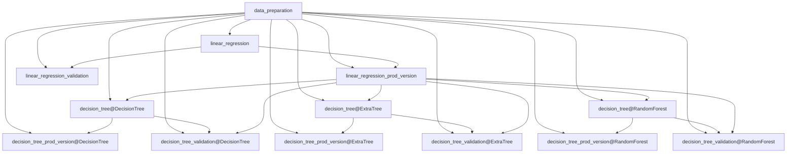

```mermaid
graph TD
        node1["data_preparation"]
        node2["decision_tree@DecisionTree"]
        node3["decision_tree@ExtraTree"]
        node4["decision_tree@RandomForest"]
        node5["decision_tree_prod_version@DecisionTree"]
        node6["decision_tree_prod_version@ExtraTree"]
        node7["decision_tree_prod_version@RandomForest"]
        node8["decision_tree_validation@DecisionTree"]
        node9["decision_tree_validation@ExtraTree"]
        node10["decision_tree_validation@RandomForest"]
        node11["linear_regression"]
        node12["linear_regression_prod_version"]
        node13["linear_regression_validation"]
        node1-->node2
        node1-->node3
        node1-->node4
        node1-->node5
        node1-->node6
        node1-->node7
        node1-->node8
        node1-->node9
        node1-->node10
        node1-->node11
        node1-->node12
        node1-->node13
        node2-->node5
        node2-->node8
        node3-->node6
        node3-->node9
        node4-->node7
        node4-->node10
        node11-->node12
        node11-->node13
        node12-->node2
        node12-->node3
        node12-->node4
        node12-->node8
        node12-->node9
        node12-->node10
```
